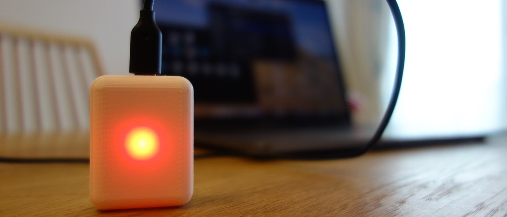

# IoTPtalk

## 概要
複数人が協調して文字起こしを行うことが可能な IPtalk はデファクトスタンダードとして国内に おいて広く認知されている。音声認識技術を用いた UD トーク、Julius2IPtalk、ブラウザ上で動作する T-TAC Caption, captiOnline 等の様々なキャプショニングソフトウェアが存在する中、これらはインター ネット配信映像へのキャプショニング提供を前提として設計されてはいない。そこで本稿では、インター ネット配信とその運営面(サスティナビリティ)の観点から理想的な機材構成を議論した後、コストが安 く、可搬性の高い小規模研究会運営に適したシステムを提案する。さらに本システムをファブリケータブ ルな素材としてオープンソース化した.

## ファイル構成
  - Application/IoTptalkController: Processing用
  - esp8266/ : 8266用 Arduinoプログラム
  - models/ : stlファイル

## Licence
[MIT](https://github.com/tcnksm/tool/blob/master/LICENCE)

## Author

[Tetsuaki Baba](https://github.com/TetsuakiBaba)
